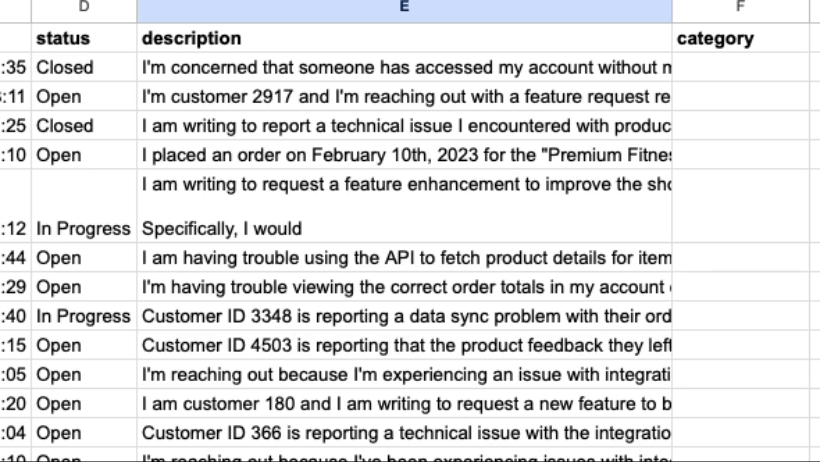

This is a template for building a data enrichment tool with Google Sheets and Llama-3 via [Groq](https://groq.com) that can intelligently categorize data.

## Functionality

The tool takes a description / summary of a support ticket as an input and categorizes it according to the `CATEGORIES` in [`app.py`](../app.py).

It uses a 70b parameter llama model to categorize the values in a cell. 

By hashing the row contents, the app is able to continuously monitor a sheet for changes and re-categorize rows that have updated.

With this template, you can create a scheduled deployment that continuously monitors your sheet for changes and categorizes new/updated rows.