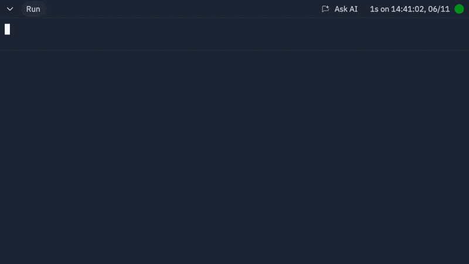

# Running your app

Everything should now be set to run! Click the "Run" button at the top of the Repl. Your Sheet should start updating and you should see output in the `Console`

## What's happening?

We're reading in each row and generating a unique "hash" or key that tells us if the row is new. 

If not, we're generating and storing a key based on the current contents in the embedded key-value database included with Replit, then we're generating a category. You'll see "Storing hash:" in the console.

If the row _hasn't_ changed, we'll skip it! You'll see "skipping" in the console.

