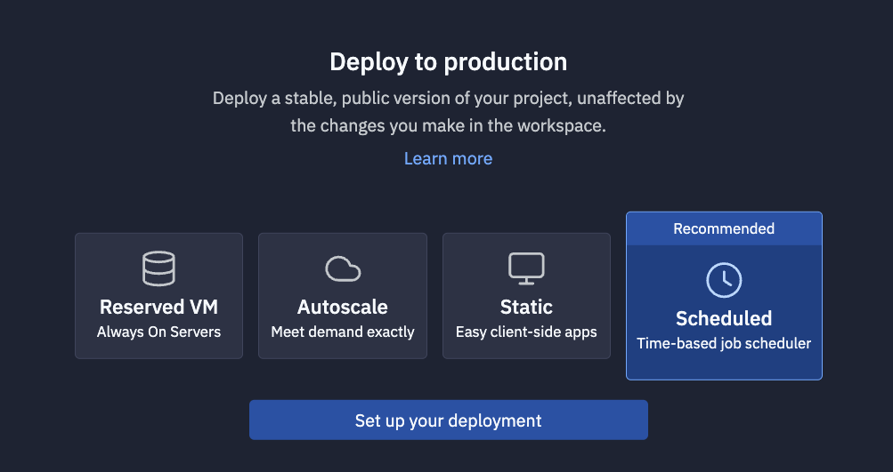
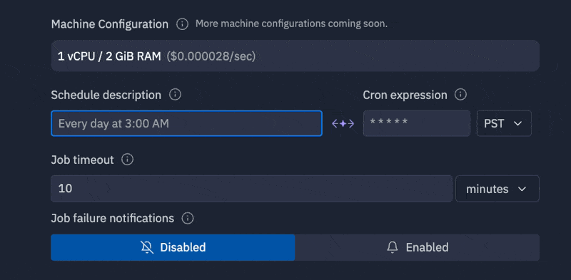

# Deploying your app

Your app is running! Great! Now what?

Maybe you'd like to monitor your sheet for changes or auto-populate new data as it arrives.

With Scheduled Deployments we can do just that. First, we'll head over to the "Deployments" pane and select "Scheduled," then "Set up your deployment"

Everything here is preconfigured for you, so all you'll need to do is set a schedule (in English). We'll handle the rest!

All you need to do now is click "Deploy!" Replit will take care of the rest.